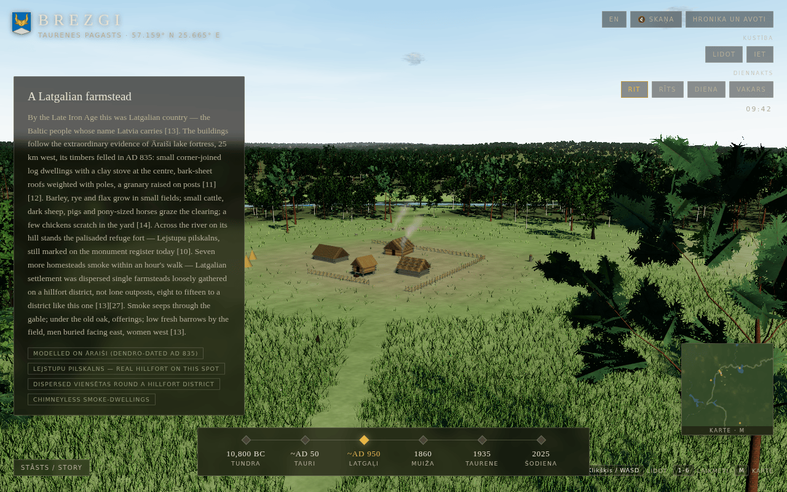

# Brezgi — a Latvian village through time



An interactive Three.js reconstruction of the landscape around the Brezgi
farmstead site in **Taurenes pagasts** (formerly Nēķenes pagasts / Nötkenshof),
Vidzeme, Latvia — the same spot of earth shown at six moments in time:

| Era | Scene |
|---|---|
| ~10,800 BC | Younger Dryas tundra, reindeer and melting dead ice |
| ~AD 50 | Near-wilderness: aurochs grazing the Gauja terrace, a hunters' camp |
| ~AD 950 | A Latgalian farmstead, modelled on the Āraiši lake-fortress evidence |
| 1860 | The Brezgi viensēta under Nēķens manor |
| 1935 | Taurene, independent Latvia — farms after agrarian reform, the old palace a clinic |
| 2025 | Satellite-mapped land cover, the Brežģa kalns tower and modern parish |

## Real geography

- **Terrain**: real elevation model, 8.8 × 8.8 km covering Taurene and Brezģis
  (57.15944 N, 25.66472 E), from AWS Open Data terrain tiles → `data/fetch-terrain.mjs`
- **Water**: the actual mapped course of the Gauja, the outline of Taurenes
  ezers, and the Dzērbe stream, from OpenStreetMap → `data/bake-geodata.mjs`
- Buildings, vegetation, animals and sound are generated procedurally. Modern
  satellite imagery and geographic data are embedded in the offline artifact;
  the finished scene does not fetch assets while you explore.

## Build & run

```bash
npm install
node data/fetch-terrain.mjs    # (optional) re-fetch the DEM
node data/bake-geodata.mjs     # (optional) re-bake river/lake geometry
node build.mjs                 # bundle -> artifact/brezgi-taurene.html
```

Open `artifact/brezgi-taurene.html` straight from disk (everything is inlined
into that one file), or run `node serve.mjs` and visit
`http://localhost:4119`.

**Controls**: click the landscape to capture the mouse, then move it to look.
**WASD or arrow keys** start flying. Space rises, Shift descends, and the wheel
adjusts flying speed. **V** or the Walk button switches to walking (Shift
sprints; Space jumps). Double-tap Space toggles flight; Escape frees the mouse.
Keys **1–6** or **[ ]** travel in time; **M** opens the map. On touch screens,
drag the landscape to look and use the on-screen direction and elevation buttons.

The six scenes combine mapped geography with historical interpretation. The
central farm is staged near Taurene; it is not a surveyed ancestral house at
Brezģis. Each era explains its evidence. See [the accuracy review](research/accuracy-review.md).

```bash
npm test             # rebuild, render all eras, check geometry and desktop/touch input
npm run test:world   # chronology, ground contact, traffic, day/night exposure
npm run test:walk    # walking and flight regressions
npm run test:items   # every animal preset and building/prop model, labelled sheets
npm run test:environment # water topology, close views, tree fades and mapped details
npm run test:roads   # rendered road/terrain contact and plant clearance
```

Browser checks use `/usr/bin/google-chrome`; `CHROME_PATH` overrides that path
for `npm test`. Screenshots and the test report go into a fresh directory under
the system temporary directory, printed by the test runner.

See [the item audit](docs/item-audit.md) for the latest environment/asset changes
and their remaining limits. The modern era is a 2025 interpretation using mixed
2020/2026 inputs, not a survey-grade capture of that year.

## Graphics pipeline (third edition)

Rendering techniques adapted from LAAS (MIT,
[Braffolk/fable5-world-demo](https://github.com/Braffolk/fable5-world-demo)),
re-implemented for WebGL and re-tuned from its Estonian old-growth reference
to Vidzeme species:

- **Trees** — parametric branching grammar (tropisms, crown envelopes,
  whorled/spiral phyllotaxis) meshed as parallel-transport bark tubes with
  root flare; real leaf/needle-spray twig meshes are rendered once at boot
  into a per-species atlas, then placed as alpha-tested cluster cards at the
  grammar's foliage anchors. Nine species: spruce, Scots pine, silver birch,
  pedunculate oak, black alder, small-leaved lime, apple, tundra dwarf
  shrub, snag. Far trees are whole-tree impostors captured from the same
  meshes.
- **Understory** — ferns (pinnate frond cards), mossy deadfall, stumps,
  glacial erratic boulders, lake-shore reed clumps.
- **Grass** — three camera-following bands of instanced blade clumps
  (~70k instances, ~350k blades) with cantilever tip² wind riding the same
  travelling gust field as the trees; midsummer flowers (meadowsweet,
  ox-eye daisy, buttercup).
- **Sky** — analytic dome + Rayleigh/Mie sun transmittance driving the
  light rig; per-pixel fbm cumulus billboards lit toward the sun; cirrus,
  dusk stars with a Milky Way band, and a fog-blended moraine horizon ring
  continuing the upland past the DEM edge.
- **Terrain** — real DEM with multi-octave albedo detail, micro-relief
  bump, slope-baring of glacial till, and river margins that read
  moist-grass → mud → gravel bar.

## Verification screenshots

```bash
node data/shot2.mjs out.png "eraNow=2;view=muiza;time=0.9;wait=900"
node data/dbg.mjs out.png "era=1;time=0.42;cam=-410,200,-16;tgt=-730,187,715;hide=clouds;probe=1"
node data/walktest.mjs   # controls regression: arrows must walk
```

(Headless Chrome throttles requestAnimationFrame, hence the instant-jump hooks
on `window.__sim`.)

## Research

Cited research notes live in `research/`; the interpretive write-up with
sources is `WRITEUP.md` and is embedded in the app under **Chronicle & sources**.

## License

[MIT](LICENSE).
